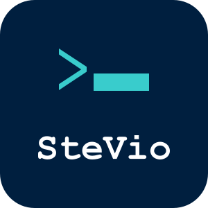

# stevio-home

The source code for [stevio.de](https://stevio.de) — my personal website and the store where I sell my desktop apps. A Go API, a React frontend, and a Postgres database, deployed as containers on a single VM. The only external services it talks to are a payment provider (Paddle) and whatever SMTP server you point it at.

This is my site, built the way I want a store to treat me as a customer: no account passwords, no tracking, and as little personal data as technically possible. The code is public mainly for transparency — what the shop collects about its users and how it tracks them isn't a privacy-policy promise, it's readable right here. It is open source under the [MIT license](LICENSE) and you are welcome to run or fork it for your own site and store — but please rebrand your fork. A lot of names in this repo refer to me (SteVio, stevio.de, my logo); see [Forking and rebranding](#forking-and-rebranding) for what to change.

## What it does

The public site is a portfolio: a landing page with a short bio, project cards, and social links, plus a detail page per project. Any project can carry a commerce attachment — a desktop app with a price, a bundle identifier, and uploaded binary releases. Buying one goes through Paddle Billing (checkout and payment happen on Paddle's side; card data never touches this server), and a signature-verified webhook turns the completed payment into a license.

Licenses are Ed25519-signed. A desktop app activates a license for a machine, receives a signed payload, and can verify it offline against the public key — the server exposes activation, deactivation, update-check, and one-time download endpoints for this, though no client SDK ships in this repo; the apps bring their own integration. Licenses have an activation cap per device, downloads use single-use expiring tokens, and refunds revoke what they paid for.

Around that core: discount codes and automatic discounts, a support chat where logged-in customers appear under a generated pseudonym ("Swift Fox") instead of their identity, an account area with self-service data export and account deletion, and an admin area (about 25 pages) covering projects, releases, orders, licenses, discounts, sales stats, payment settings, signing keys, legal pages, languages, translations, and mail templates.

Payment providers are pluggable behind a small interface. Besides Paddle there is a mock provider that drives the exact same webhook fulfillment path with HMAC-signed events — useful for rehearsing the full purchase flow. Selecting it force-enables maintenance mode, so a store that mints licenses without real payments is never publicly reachable.

Localization is database-driven and editable from the admin UI: locales, UI strings, per-entity content translations, legal pages, and mail templates. German is the default, English ships alongside, and more languages can be added at runtime without a rebuild.

## Security and privacy

These are design decisions, not a compliance checklist — each one is enforced in code:

- **No passwords.** Login is a single-use magic link sent by email. Tokens are 256-bit random values, stored only as hashes, and expire after 15 minutes. The login endpoint gives an identical response whether or not a link was just sent, so it can't be used to probe accounts.
- **Email addresses are never stored in plaintext.** Users, sessions, orders, and tokens are keyed by an HMAC-SHA256 of the email with a per-deployment secret salt. A database dump does not contain your customers' addresses. (One deliberate exception: a customer can explicitly choose to share their address in the support chat.)
- **No tracking.** No analytics, no third-party requests at runtime, self-hosted fonts, and the only cookie is the session cookie. The Content Security Policy is `default-src 'self'` with no inline scripts.
- **Secrets are encrypted at rest.** Paddle API credentials and license signing keys live AES-256-GCM-encrypted in the database. Payment credentials are configured through the admin UI on purpose — there is no environment-variable fallback to leak.
- **Sessions are server-side.** The cookie holds an HMAC-signed session ID (HttpOnly, SameSite=Lax, Secure in production). Admin sessions last 24 hours versus 30 days for customers, and the admin list is an environment allowlist — anyone removed from it is demoted and logged out on the next restart.
- **Every route declares its access level.** The router only accepts routes registered as public, authenticated, or role-gated; there is no way to add an endpoint without making that decision explicitly.
- **Data minimization at runtime.** Client IPs exist only in memory for rate limiting and are evicted after 30 minutes — they are never written to the database. Expired sessions and login tokens are purged hourly.
- **Self-service data rights.** Customers can download everything stored about them as JSON and delete their account themselves. Orders are anonymized rather than deleted, because tax law requires keeping them.
- The usual hardening on top: parameterized SQL everywhere, global and per-route IP rate limits, path-traversal-safe file handling, markdown rendered with raw HTML escaped, mandatory TLS for SMTP with header-injection stripping, webhook signature verification with replay protection, non-root containers, and a Postgres that is never exposed outside the internal Docker network.

Found a hole in any of this? Please report it privately — see [SECURITY.md](SECURITY.md).

## Tech stack

The backend is Go 1.26 with the standard library's `net/http` router — no web framework — and four direct dependencies: pgx (Postgres), the official Paddle SDK, cobra (for the operator CLI), and goldmark (markdown). SQL is hand-written; migrations are embedded `.sql` files applied at startup. `store-cli` handles operator chores: generating secrets, hashing emails, checking config, managing signing keys.

The frontend is React 19 with TypeScript, built by Vite. Routing is react-router, state is plain React context, and styling is a single hand-written CSS file — no state-management library, no CSS framework. Tests run on Vitest with Testing Library and axe for accessibility checks.

In production, Caddy terminates TLS (automatic Let's Encrypt) in front of an nginx container serving the SPA and proxying the API to the Go backend, with Postgres 17 behind it. Everything runs as containers on one VM.

## Running it locally

You need Go 1.26+, Node 20+, Docker with Compose, and [just](https://github.com/casey/just). (There is also a Nix flake with direnv support that provides the whole toolchain.)

```
just up
```

That builds and starts Postgres, the backend, and the frontend. The site is at http://localhost:3000. No SMTP server is needed for development — login emails are printed to the backend's stdout, and

```
just magiclink
```

fishes the login URL out of the logs for you. `just test` runs the backend checks (build, tests, vet, lint), `just test-frontend` the frontend ones. Backend integration tests need a Postgres via `TEST_DATABASE_URL` and skip cleanly without it; each test gets its own throwaway schema, so they run in parallel.

## First-run setup

A fresh instance needs a few things before it can sell anything:

1. Generate the three required secrets: `just gensecret` (sessions), `just gensigningsecret` (encryption of keys and credentials at rest), `just gensalt` (email hashing). The server refuses to start without them. `backend/.env.example` documents every variable.
2. Put your own email address in `ADMIN_EMAILS` and log in via magic link — that account is an admin.
3. In the admin area, set the site name, write your legal pages (they ship as placeholders), add a license signing key, and enter your payment provider credentials under Payment.

## Production deployment

The canonical production setup is documented in [infra/README.md](infra/README.md): a single Flatcar Container Linux VM (written for Hetzner Cloud, adaptable elsewhere) provisioned via Butane/Ignition, running `docker-compose.deploy.yml` — Caddy with automatic TLS, images pulled from GHCR by pinned tag, daily rotated Postgres dumps, and optional client-side-encrypted offsite backups via rclone. Updates are deliberate: bump the image tag, restart the service; migrations apply themselves on startup.

If you'd rather build from source and skip the Flatcar setup, `docker-compose.example.yml` is a minimal annotated starting point — check its volume paths against your host before using it.

## German and EU specifics

I run this under German law, and some of that is built in: the default locale is German, the legal pages use German slugs (`/impressum`, `/datenschutz`, `/widerruf`, with English aliases), checkout asks EU customers to consent to waiving the digital-goods withdrawal right before payment, deleted accounts keep anonymized order records for the statutory retention period, and maintenance mode always leaves the legal pages reachable. All legal page content is configured through the admin UI, so nothing binds you to German text — but if you operate outside the EU, review whether the consent step and retention behavior match your jurisdiction.

## Forking and rebranding

Most branding is already configuration, not code. What a fork needs to touch, roughly in order of effort:

- **Nothing at all:** site name, contact addresses, and legal pages are set in the admin UI; domain, ACME email, and base URL are environment variables.
- **A few small edits:** the OpenGraph/Twitter meta tags in `frontend/index.html` (they say "SteVio"), the logo (`frontend/public/stevio-logo.svg`, `frontend/public/favicon.svg`, `media/stevio-logo.svg`), the GHCR image names in `docker-compose.deploy.yml` (CI already publishes under your own GitHub owner on a fork), and — if you use the Flatcar setup — the `/data/stevio` host paths and `stevio.service` unit name in `infra/`. The default Postgres database and user are named `stevio`; override them via the compose environment if you care.
- **Optional and sweeping:** the Go module path is `github.com/SteVio89/stevio-home`, which appears in every backend import. Everything builds and runs fine if you leave it; rename it only if you plan to publish your fork as an importable module.
- **Leave alone:** the `stevio` Unix user inside the containers, the `stevio:` log prefixes, and the `STEVIO_ENV` variable are internal identifiers, not branding.

## Scope

This is built for exactly one deployment shape: a single VM, a single operator, moderate traffic. Rate limiting is in-memory and per-process, migrations are forward-only, and the published images are linux/amd64. None of that is a problem for what it is — a personal site and store — but if you need horizontal scaling, this codebase is not trying to give it to you.

## Contributing and license

This isn't a community project and I don't expect contributions, but issues and pull requests are welcome if you've found a bug or want to improve something — [CONTRIBUTING.md](CONTRIBUTING.md) has the development setup and code conventions. The vulnerability disclosure policy is in [SECURITY.md](SECURITY.md). Licensed under the [MIT license](LICENSE).
